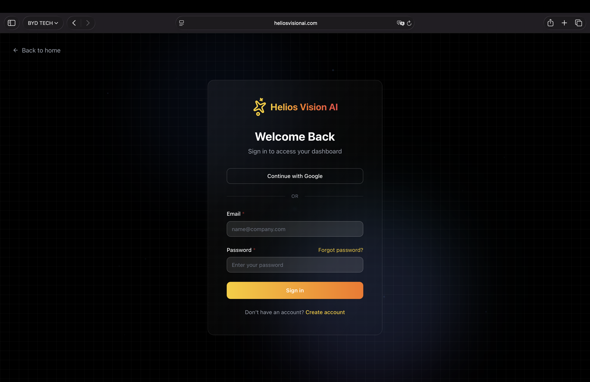
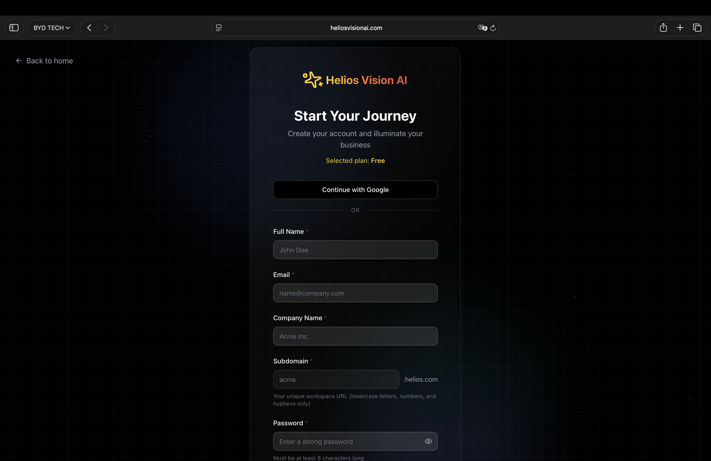

## Objective

Explain how to enter the portal, create an account, accept invitations and recover password.

## Key routes

- /login
- /pricing (plan selection)
- /signup?plan=...
- /auth/complete?plan=...
- /forgot-password
- /reset-password
- /auth/invite/{token}

## Login

Steps:

1. Go to /login.
2. Choose an option:
   - Continue with Google
   - Email + Password
3. If you use Email + Password, complete the fields and press Sign in.

Fields:

| Field | Mandatory | Format | Example | Note |
| --- | --- | --- | --- | --- |
| Email | Yes | valid email | name@company.com | It is used for authentication |
| Password | Yes | minimum 8 characters | ******** | - |

## Create account (signup)

Recommended flow:

1. Go to /pricing and choose a plan.
2. The page takes you to /signup?plan=PLAN.
3. Complete the form and press Create account.

Fields:

| Field | Mandatory | Format | Example | Note |
| --- | --- | --- | --- | --- |
| Full Name | Yes | free text | John Doe | Initial owner name |
| Email | Yes | valid email | name@company.com | Main email |
| Company Name | Yes | free text | Acme Inc. | Tenant name |
| Subdomain | Yes | lowercase, numbers and hyphens | Acme | Used for the workspace URL |
| Password | Yes | minimum 8 characters | ******** | - |

Notes:

- If you choose Google OAuth, the flow can redirect to /auth/complete to complete tenant data.
- The subdomain must be unique.

## Complete account (OAuth)

If you log in with Google and there is no tenant, /auth/complete is displayed.

Fields:

| Field | Mandatory | Format | Example | Note |
| --- | --- | --- | --- | --- |
| Company Name | Yes | free text | Acme Inc. | Tenant name |
| Subdomain | Yes | lowercase, numbers and hyphens | Acme | Workspace URL |

## Email verification

Some actions require verified email (for example: creating agents or uploading documents). If you see a verification message:

1. Open the verification email.
2. Click on the link.
3. Return to the portal and repeat the action.

## Team invitations

If you receive an invitation link:

1. Open /auth/invite/{token}.
2. Complete the form to create your user.
3. Upon completion, the tenant's Dashboard opens.

Fields:

| Field | Mandatory | Format | Example | Note |
| --- | --- | --- | --- | --- |
| Full Name | Yes | free text | Juan Perez | Must be at least 2 characters |
| Password | Yes | minimum 8 characters | ******** | - |
| Confirm Password | Yes | equal to password | ******** | - |

## Recover password

1. Go to /forgot-password.
2. Write your Email and press Send reset link.
3. Open the email and enter the link.
4. In /reset-password define the new password.

Reset fields:

| Field | Mandatory | Format | Example | Note |
| --- | --- | --- | --- | --- |
| New Password | Yes | minimum 8 characters | ******** | - |
| Confirm Password | Yes | equal to password | ******** | - |

## Log out

Use the user menu in the sidebar (or the Sign out option) to log out.

## Suggested illustrations

### Login with Google and Email

### Signup with subdomain

