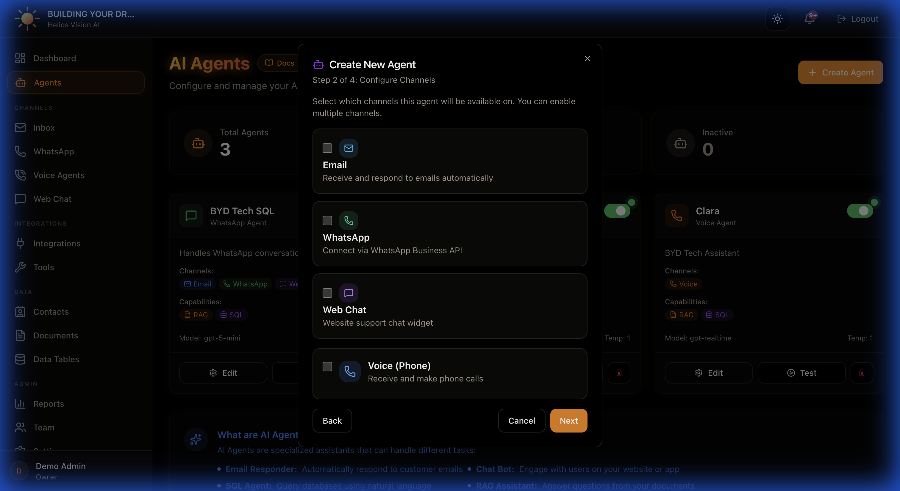
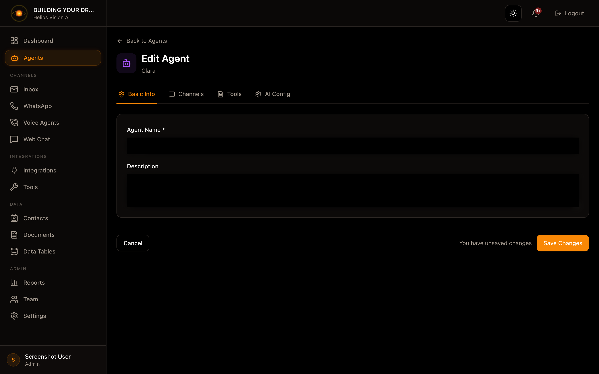

## Objective

Create and configure AI assistants that operate in Email, WhatsApp, Web Chat and Voice. Each agent defines channels, capabilities and AI configuration.

## Access

Sidebar -> Agents
Path: /app/{tenant}/agents

## Roles

- owner, admin, agent

## Prerequisites

- Integrations: at least one LLM provider (OpenAI or Google) if your plan does not include models.
- Documents: required to enable RAG.
- SQL Tables: required to enable SQL.
- Tools: optional, only if you want external actions.
- Voice: if you activate voice, then you must create a Voice Agent with a number in the Voice Agents module.
- Verified email: required to create agents.

## Create an agent (Create Agent)

Step by step:

1. Under Agents, tap Create Agent.
2. Complete the 4 steps of the modal.

### Step 1: Basic Information

Fields:

| Field | Mandatory | Format | Example | Note |
| --- | --- | --- | --- | --- |
| Agent Name | Yes | free text | Customer Support Agent | Name visible on the portal |
| Description | No | free text | Answer support questions | Defines tone and role |

### Step 2: Configure Channels

Select one or more channels. Note: If you enable Voice, the form disables Email/WhatsApp/Web Chat in this step.

- Email: responses in Inbox.
- WhatsApp: conversations in WhatsApp module.
- Web Chat: web widget.
- Voice: telephony (requires Voice Agents + Twilio).

### Step 3: Agent Capabilities

Options:

- RAG (Google File Search)
  - Requires Google AI API Key and uploaded documents.
  - You must select at least 1 document.
- SQL Database Access
  - Requires tables in SQL Tables.
  - You must select at least 1 table.
- Web Search
  - Allow external queries if you have Bing Web Search configured.
-Tools & Actions
  - Select tools created in Tools.

Fields and data (RAG):

| Field | Mandatory | Format | Example | Note |
| --- | --- | --- | --- | --- |
| Knowledge Base Documents | Yes (if RAG active) | multiple selection | FAQ.pdf | Select relevant documents |

Fields and data (SQL):

| Field | Mandatory | Format | Example | Note |
| --- | --- | --- | --- | --- |
| Allowed Tables | Yes (if SQL active) | multiple selection | orders, inventory | Limit agent access |

Fields and data (Tools):

| Field | Mandatory | Format | Example | Note |
| --- | --- | --- | --- | --- |
| Tools | No | multiple selection | Create Ticket | Only tools created in Tools |

### Step 4: AI Configuration

Fields:

| Field | Mandatory | Format | Example | Note |
| --- | --- | --- | --- | --- |
| Provider | Yes | dropdown | OpenAI | It depends on your plan and keys |
| Model | Yes | dropdown | gpt-4o | Some models require BYOK |
| Temperature | Yes | 0.0 - 1.0 | 0.7 | Some models set 1.0 |
| Max Tokens | Yes | number | 800 | Limited by model |
| Top P | Yes | 0.0 - 1.0 | 1.0 | Sampling control |
| SystemPrompt | No | long text | You are a helpful assistant | Character limit |

Actions:

- Next to advance.
- Create Agent to save.

## Edit an agent

Path: /app/{tenant}/agents/{id}/edit

The form uses tabs:

### Basic Info

- Agent Name
-Description

###Channels

- Email / WhatsApp / Web Chat / Voice
- If you activate Voice, you can define Initial Greeting (max 500 chars)

### Tools (Capabilities)

- RAG: select documents
- SQL: select tables
- Web Search
-Tools & Actions

### AI Config- Model, Temperature, Max Tokens, Top P
- Timezone (optional)
-System Prompt
- Insert tools context (insert tool references to the prompt)
- Human Escalation: Detect escalation requests

Actions:

- Save Changes to save.
- Cancel to return to Agents.

## Test an agent

Path: /app/{tenant}/agents/{id}/test

Main functions:

- Send test messages.
- View traces (RAG, SQL, tools).
- Test voice if the agent has voice enabled.

## Activate or deactivate an agent

In the Agents list, use the status toggle on each card.

## Delete an agent

On the agent card, use Delete. Confirm the action.

## Good practices

- Use a clear name per use case (Support, Sales, Collections).
- Enable only channels that you are going to operate.
- For RAG, upload clean documents with clear names.
- For SQL, limit the tables to those needed.
- Keep the System Prompt below the limit, especially in voice.

## Common errors

- Models do not appear: API key is missing in Integrations or the plan does not include the model.
- RAG disabled: Google key or documents missing.
- SQL disabled: no tables.

