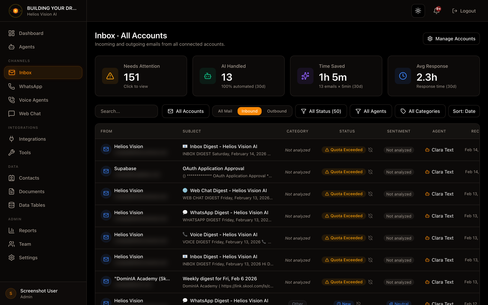

## Objective

Manage incoming and outgoing emails with AI and human approval (human-in-the-loop).

## Access

Sidebar -> Inbox
Routes:

- /app/{tenant}/inbox (main view)
- /app/{tenant}/inbox/all (all accounts)
- /app/{tenant}/inbox/{credentialId} (one account)
- /app/{tenant}/inbox/message/{id} (email details)

## Roles

- owner, admin, agent

## Prerequisites

- At least one agent with Email channel enabled.
- A connected Email account (Gmail/Outlook OAuth or SMTP/IMAP).
- Integrations with OpenAI or Google if the plan does not include models.

## Connect an email account

In Inbox, tap Connect Email Account (or Email Accounts).

Options:

1) Gmail/Workspace (OAuth)
2) Outlook/Microsoft 365 (OAuth)
3)Custom SMTP/IMAP

### Gmail (OAuth)

Steps:

1. In the Email Accounts panel, choose Gmail.
2. Select an agent in Assign agent.
3. Press Connect Gmail (OAuth).
4. Complete the Google Flow and return to the portal.

### Outlook (OAuth)

Steps:

1. In the Email Accounts panel, choose Outlook.
2. Select an agent in Assign agent.
3. Press Connect Outlook (OAuth).
4. Complete the Microsoft flow and return to the portal.

### SMTP/IMAP (Custom)

Steps:

1. Press Add via SMTP/IMAP.
2. Complete Account Information and SMTP Settings.
3. (Optional) Complete IMAP Settings for incoming emails.
4. Press Add Account.

Fields: Account Information

| Field | Mandatory | Format | Example | Note |
| --- | --- | --- | --- | --- |
| Email Address | Yes | valid email | support@acme.com | Connected account |
| Display Name | No | text | Acme Support | Display name |
| Signature | No | long text | Regards, Acme | Account signature |
| Auto-Reply Language | Yes | language or auto code | car | Auto = sender mirror |
| Assign agent | Yes | selection | Support Agent | Required for AI |
| Generate AI Responses | No | checkbox | ON/OFF | Create AI drafts |

Fields: SMTP Settings (Outbound - Required)

| Field | Mandatory | Format | Example | Note |
| --- | --- | --- | --- | --- |
| SMTP Host | Yes | hostname | smtp.gmail.com | - |
| Port | Yes | number | 587 | - |
| SMTP Username | Yes | text | user@acme.com | - |
| SMTP Password | Yes | text | ******** | - |
| Use TLS/SSL | No | checkbox | ON | Recommended |

Fields: IMAP Settings (Inbound - Optional)

| Field | Mandatory | Format | Example | Note |
| --- | --- | --- | --- | --- |
| IMAP Host | No | hostname | imap.gmail.com | Required to receive |
| Port | No | number | 993 | - |
| IMAP Username | No | text | user@acme.com | - |
| IMAP Password | No | text | ******** | - |
| Use TLS/SSL | No | checkbox | ON | Recommended |

## Manage connected accounts

In the account list you can:

- Verify: test connectivity.
- Test email: send test email.
- Toggle Active/Inactive.
-Assign Agent.
- Delete.
- Edit (opens Email Configuration).

## Email Configuration (per account)

Quick route: Inbox -> account card -> Edit

### Account Configuration

Fields:

| Field | Mandatory | Format | Example | Note |
| --- | --- | --- | --- | --- |
| From Name | No | text | Helios Support | Sender name |
| Assigned Agent | Yes | selection | Support Agent | Required for AI |
| Account Signature | No | long text | Regards, {agent_name} | Applies when sending |

Available signature variables:

- {sender_name}
- {agent_name}
- {tenant_name}
- {account_email}
- {sender_role}

### AI Response Settings- Generate AI Responses: create drafts.
- Send Automatically: send without approval.
- Agent Signature: signature of the agent.
- Auto-Reply Language: auto response language.
- Require Manual Review For: High / Urgent.
- Auto-Reply Guard: blocking rules for tokens, domains and headers.

Key fields (Auto-Reply Guard):

| Field | Usage | Example |
| --- | --- | --- |
| Additional blocked sender tokens | Block senders with tokens | noreply, billing |
| Additional blocked domains | Block domains | noreply.company.com |
| Allowed reply domains | Only reply to domains | yourcompany.com |
| Block headers | Block by headers | List-Unsubscribe |

### Email Categorization

- List of active categories.
-Enable dynamic categories.
-Enable Other category.
- Sync categories to Gmail labels / Outlook categories.
- Archive on label sync (Gmail only).

### Daily Summary Email

Set up a daily activity summary.

Fields:

| Field | Mandatory | Format | Example | Note |
| --- | --- | --- | --- | --- |
| Enable Daily Summary | No | checkbox | ON | Activate summary |
| Send Time | Yes (if enabled) | HH:MM | 08:00 | Local time |
| Timezone | Yes (if enabled) | timezone | America/Bogota | - |

## Inbox (email list)

Main functions:

- Search: search by sender, subject, agent, category.
- Account filter: filter by account.
- Direction: inbound / outbound.
- Status: pending, ready_for_review, approved, sent, reviewed, failed, quota_exceeded.
- Agent filter: all, unassigned, or an agent.
- Category filter: all, uncategorized, not_analyzed, or a category.
- Sort: Date or Category.
- Sync: (only in single account view) force synchronization.

## Email details

Path: /app/{tenant}/inbox/message/{id}

Main sections:

1) Subject
2) Summary (Generate/Refresh summary)
3) AI-Generated Response (editable)
4) Original Message
5) Metadata (Received, Assigned agent, Send using, Signature)
6) Analysis (Intent, Sentiment, Category, Tags)

Actions:

-Regenerate Response
- No Reply Needed
- Approve & Send
- Refresh summary / analysis
- Reassign agent
- Choose shipping account (Send using)
- Choose signature (My / Agent / Account / None)

Important notes:

- If Auto-reply blocked, the system deactivates AI and asks for confirmation to send.
- To send, the response field must not be empty.

## Good practices

- Assign an agent to each account before activating AI.
- Use clear categories for classification.
- Maintain Auto-Reply Guard rules to avoid no-reply responses.
- Use signatures with variables for consistency.

## Common errors

- Reconnect required in Gmail: reconnect the OAuth from the card.
- Verify fails: check SMTP/IMAP and credentials.
- AI response does not appear: check agent and LLM provider.

## Suggested illustrations

### Email Accounts

### Email Detail
