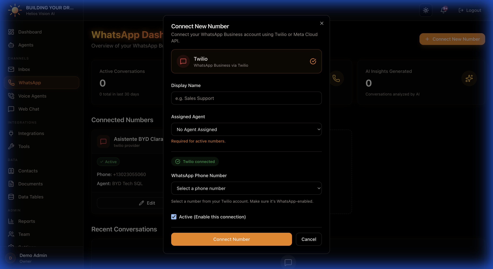

## Objective

Connect WhatsApp Business numbers and manage conversations in real time.

## Access

Sidebar -> WhatsApp
Path: /app/{tenant}/whatsapp

## Roles

- owner, admin, agent

## Prerequisites

- Integrations: Twilio connected (recommended) or Meta Cloud API.
- Agent with WhatsApp channel enabled.

## Connect a number (Connect New Number)

Step by step:

1. In WhatsApp, tap Connect New Number.
2. Complete the modal fields.
3. Press Connect Number.

Fields:

| Field | Mandatory | Format | Example | Note |
| --- | --- | --- | --- | --- |
| Display Name | Yes | text | Sales Support | Display name |
| Assigned Agent | Yes (if Active) | selection | Support Agent | You must have WhatsApp enabled |
| Active | No | checkbox | ON | If active, requires agent |

### Twilio (recommended)

- Requires Twilio connected in Integrations.
- Select the number from the Twilio dropdown.
- If it does not appear, use manual entry with the format: whatsapp:+1234567890.

### Meta Cloud API (legacy)

Fields:

| Field | Mandatory | Format | Example | Note |
| --- | --- | --- | --- | --- |
| Phone Number ID | Yes | text | 123456789 | From Meta Business |
| Business Account ID | No | text | 987654321 | Optional |
| Access Token | Yes | token | EAAG... | Permanent token |

## Manage connected numbers

On each card you can:

- Toggle Active/Inactive.
- Edit (opens editing modal).
- Delete (requires confirmation).

## Recent conversations

In the conversation table:

- Click on View Chat to open the conversation.
- Status, last message and sentiment if it exists are shown.

## Conversation view (WhatsApp chat)

Path: /app/{tenant}/whatsapp/{id}

Actions:

- Send message (textarea + Send).
- Close / Archive / Reopen according to status.
- Toggle AI Active / AI Disabled.
- Delete (admin/owner only).
- Generate Insights (sentiment + summary).

Key fields in the sidebar (AI Insights):

- Sentiment Analysis
- Conversation Summary

## WhatsApp notifications

Path: /app/{tenant}/whatsapp/notifications

Features:

- See escalation alerts or new messages.
- Mark as read individual or Mark all as read.
- Open the conversation from the link.

## Good practices

- Assign an agent before activating the number.
- Use Twilio as primary provider.
- If you deactivate AI, the conversation is only for humans.

## Common errors

- Numbers do not appear: check Twilio in Integrations.
- Error sending: check format of the number and credentials.

## Related

- 22-twilio-setup.md
- 08-integrations.md
- 03-agents.md

