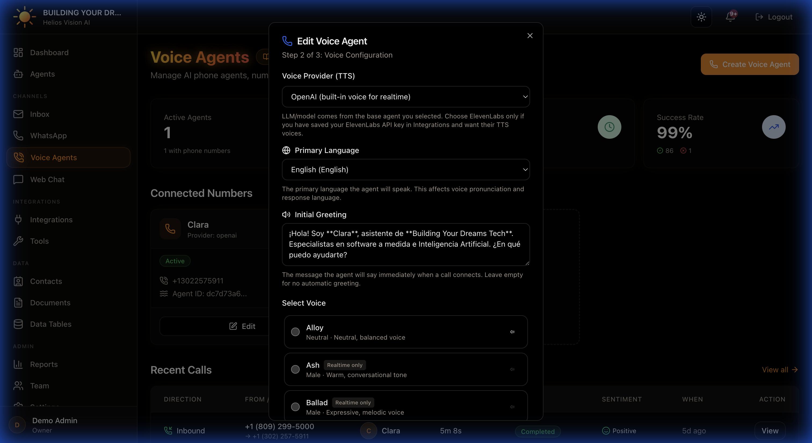

## Objective

Configure voice agents with phone numbers (Twilio) and analyze calls.

## Access

Sidebar -> Voice Agents
Path: /app/{tenant}/voice-agents

## Roles

- owner, admin, agent

## Prerequisites

- Integrations: Twilio connected.
- Agents: a base agent with Voice channel enabled and realtime compatible model.
- Integrations: OpenAI for analytics (transcription/summary/sentiment).
- Integrations: ElevenLabs if you want external TTS voice.

## Create a Voice Agent

Under Voice Agents, tap Create Voice Agent.

The modal has 3 steps:

### Step 1: Select Base Agent

Fields:

| Field | Mandatory | Format | Example | Note |
| --- | --- | --- | --- | --- |
| Base Agent | Yes | selection | Support Agent | Must have Voice enabled |

### Step 2: Voice Configuration

Fields:

| Field | Mandatory | Format | Example | Note |
| --- | --- | --- | --- | --- |
| Voice Provider | Yes | OpenAI or ElevenLabs | OpenAI | ElevenLabs requires key |
| Primary Language | Yes | language code | is | Affects pronunciation |
| Initial Greetings | No | text | Hello, how can I help you | Plays on startup |
| Voice (OpenAI) | Yes | selection | alloy | Some voices do not have a preview |
| Voice ID (ElevenLabs) | Yes | text | UOIqAnmS... | From ElevenLabs |

Call Analytics (if OpenAI connected):

- Transcription (enable)
- AI Summary (enable)
- Sentiment Analysis (enable)
- Call Recording (enable, requires Twilio)

Call Termination:

-Enable End Call (ON/OFF)
- End Call Prompt (long text)
- Inactivity Timeout (seconds, 5-60)

### Step 3: Phone Number (Twilio)

Options:

- Save Twilio SID/Auth Token if you are not connected.
- Select an existing Twilio number (dropdown).
- Manual Phone Number (+E.164 format).

Fields:

| Field | Mandatory | Format | Example | Note |
| --- | --- | --- | --- | --- |
| Twilio Account SID | Yes (if not connected) | AC... | ACxxxx | Integrations |
| Twilio Auth Token | Yes (if not connected) | 32 chars | ******** | Integrations |
| Phone Number | Yes | +E.164 | +15551234567 | Twilio number |

## Manage Voice Agents

On each card:

- Toggle Active/Inactive.
- Edit
- Delete.

## Calls

Routes:

- /app/{tenant}/voice-agents/calls (list)
- /app/{tenant}/voice-agents/calls/{callId} (detail)

Data displayed:

- Direction (inbound/outbound)
-From/To
-Agent
- Duration
- Status
- Sentiment
- Date and time

## Good practices

- Use an agent base with a clear and brief prompt.
- Defines a short Initial Greeting.
- Activate Inactivity Timeout as a backup.
- If you use ElevenLabs, validate that the Voice ID is correct.

## Common errors

- The base agent does not appear: the agent does not have Voice enabled or the model is not realtime.
- Numbers do not appear: Twilio not connected.
- Analytics not working: OpenAI not connected.

## Related

- [Twilio Setup (WhatsApp + Voice)](/helios/en/22-twilio-setup)
- [Integrations](/helios/en/08-integrations)
- [AI Agents](/helios/en/03-agents)

