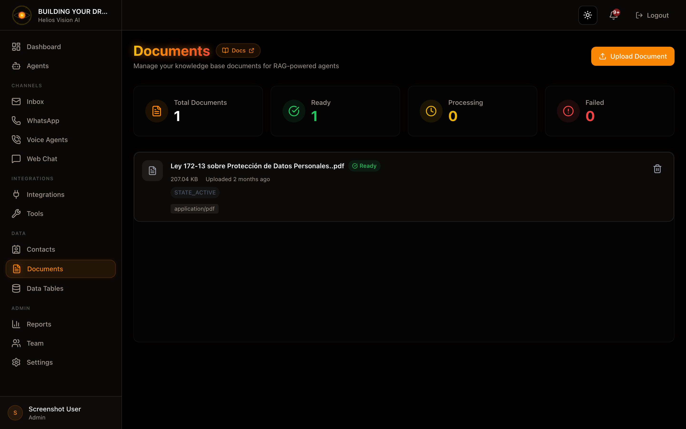

## Objective

Manage documents for RAG (knowledge base) used by agents.

## Access

Sidebar -> Documents
Path: /app/{tenant}/documents

## Roles

- owner, admin, agent

## Prerequisites

- Integrations: Google AI API Key (required for Google File Search).
- Verified email: required to upload documents.

## Upload a document (Upload Document)

Step by step:

1. Press Upload Document.
2. Drag or select a file.
3. Complete the fields.
4. Press Upload Document.

Supported types:

- PDF, TXT, MD, DOCX
- Max 10MB

Fields:

| Field | Mandatory | Format | Example | Note |
| --- | --- | --- | --- | --- |
| Document File | Yes | file | FAQ.pdf | Max 10MB |
| Display Name | No | text | FAQ Helios EN | Display name |
| Description | No | text | Use this doc for privacy | Indicates when to use |
| Document Type | Yes | selection | general | Adjust chunking |

Document Type and usage:

- overall: balanced
- legal: small chunks
- technical: larger chunks
- faq: very small chunks

## Document States

-Ready
- Processing
- Failed (see error)

## Delete document

In the list, press the delete icon and confirm.

## Good practices

- Use clear and consistent names.
- Define Description to guide the agent.
- Split long documents by topic.

## Screenshot

## Related

- [03-agents.md](./03-agents.md) (RAG)

