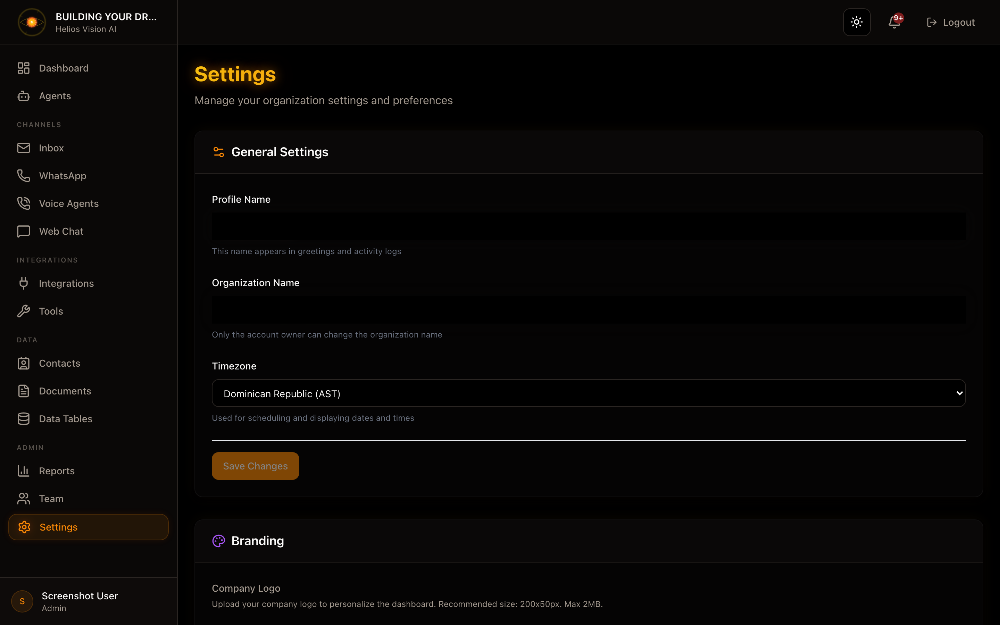

## Objective

Configure general tenant data and review plan limits.

## Access

Sidebar -> Settings
Path: /app/{tenant}/settings

## Roles

- owner, admin

## General Settings

Fields:

| Field | Mandatory | Format | Example | Note |
| --- | --- | --- | --- | --- |
| Organization Name | Yes | text | Acme Inc. | Display name |
| Timezone | Yes | timezone | America/Bogota | Affects dates |
| Language | Yes | language | is | Default language |

Actions:

- Save Changes

## Plan & Usage (summary)

The page shows:

- Current plan and limits.
- Use of users, agents, documents, email accounts, webhooks and messages.
- Access to Billing.

## Good practices

- Adjust Timezone before configuring reports.
- Check limits if any module fails due to quota.

## Screenshot

## Related

- [Billing & Usage](/helios/en/19-billing-usage)
- [API Keys (BYOK)](/helios/en/18-settings-api-keys)

