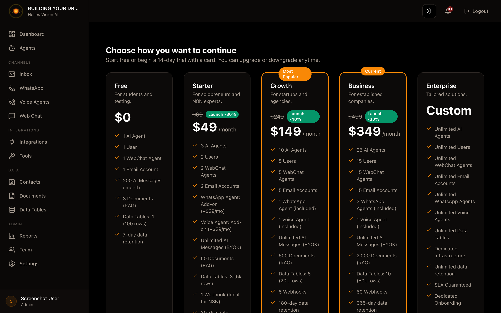

## Objective

Select plan during tenant onboarding.

## Access

Path: /app/{tenant}/onboarding/plan

## Roles

- owner, admin

## Flow

1. PlanSelector is displayed with available plans.
2. Choose the desired plan.
3. If payment is required, complete the Stripe flow.

## Data displayed

- Plan name, description and price.
- Limits and features.
- Current plan (if applicable).

## Good practices

- Check limits before choosing the plan.
- Consider using trial if it is enabled.
## Screenshot

