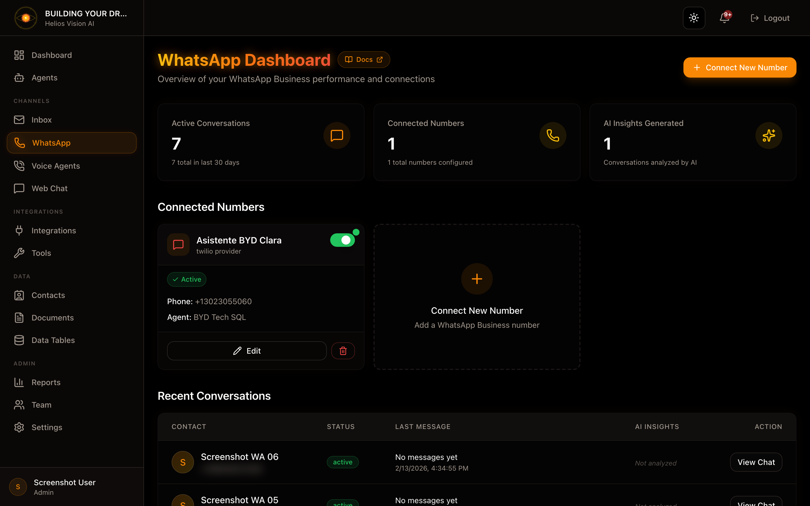

## Objetivo

Conectar numeros de WhatsApp Business y gestionar conversaciones en tiempo real.

## Acceso

Sidebar -> WhatsApp
Ruta: /app/{tenant}/whatsapp

## Roles

- owner, admin, agent

## Requisitos previos

- Integrations: Twilio conectado (recomendado) o Meta Cloud API.
- Agent con canal WhatsApp habilitado.

## Conectar un numero (Connect New Number)

Paso a paso:

1. En WhatsApp, pulsa Connect New Number.
2. Completa los campos del modal.
3. Pulsa Connect Number.

Campos:

| Campo | Obligatorio | Formato | Ejemplo | Nota |
| --- | --- | --- | --- | --- |
| Display Name | Si | texto | Sales Support | Nombre visible |
| Assigned Agent | Si (si Active) | seleccion | Support Agent | Debe tener WhatsApp habilitado |
| Active | No | checkbox | ON | Si esta activo, requiere agent |

### Twilio (recomendado)

- Requiere Twilio conectado en Integrations.
- Selecciona el numero desde el dropdown de Twilio.
- Si no aparece, usa entrada manual con formato: whatsapp:+1234567890.

### Meta Cloud API (legacy)

Campos:

| Campo | Obligatorio | Formato | Ejemplo | Nota |
| --- | --- | --- | --- | --- |
| Phone Number ID | Si | texto | 123456789 | Desde Meta Business |
| Business Account ID | No | texto | 987654321 | Opcional |
| Access Token | Si | token | EAAG... | Token permanente |

## Gestionar numeros conectados

En cada card puedes:

- Toggle Active/Inactive.
- Edit (abre modal de edicion).
- Delete (requiere confirmacion).

## Conversaciones recientes

En la tabla de conversaciones:

- Click en View Chat para abrir la conversacion.
- Se muestran status, ultimo mensaje y sentimiento si existe.

## Vista de conversacion (WhatsApp chat)

Ruta: /app/{tenant}/whatsapp/{id}

Acciones:

- Enviar mensaje (textarea + Send).
- Close / Archive / Reopen segun estado.
- Toggle AI Active / AI Disabled.
- Delete (solo admin/owner).
- Generate Insights (sentiment + summary).

Campos clave en la barra lateral (AI Insights):

- Sentiment Analysis
- Conversation Summary

## Notificaciones de WhatsApp

Ruta: /app/{tenant}/whatsapp/notifications

Funciones:

- Ver alertas de escalacion o nuevos mensajes.
- Mark as read individual o Mark all as read.
- Abrir la conversacion desde el link.

## Buenas practicas

- Asigna un agent antes de activar el numero.
- Usa Twilio como proveedor principal.
- Si desactivas AI, la conversacion queda solo para humanos.

## Errores comunes

- No aparecen numeros: revisa Twilio en Integrations.
- Error al enviar: revisa formato del numero y credenciales.

## Relacionados

- [22-twilio-setup.md](./22-twilio-setup.md)
- [08-integrations.md](./08-integrations.md)
- [03-agents.md](./03-agents.md)

