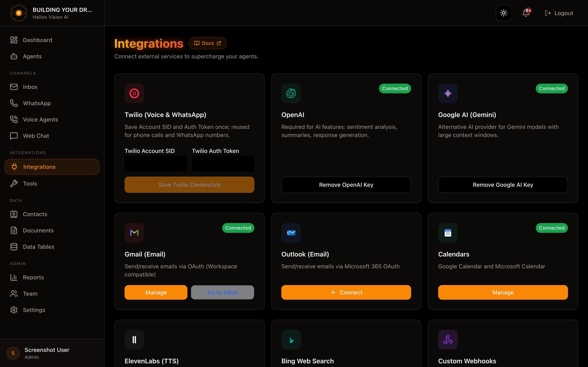

## Objetivo

Conectar servicios externos (LLM, correo, Twilio, calendarios, webhooks) para habilitar funciones del portal.

## Acceso

Sidebar -> Integrations
Ruta: /app/{tenant}/integrations

## Roles

- owner, admin, agent

## Integraciones disponibles

### Twilio (Voice & WhatsApp)

Campos:

| Campo | Obligatorio | Formato | Ejemplo | Nota |
| --- | --- | --- | --- | --- |
| Twilio Account SID | Si | AC... | ACxxxxxxxx | Desde Twilio Console |
| Twilio Auth Token | Si | 32 chars | ******** | Desde Twilio Console |

Acciones:

- Save Twilio Credentials
- Disconnect Twilio

### OpenAI

Campos:

| Campo | Obligatorio | Formato | Ejemplo | Nota |
| --- | --- | --- | --- | --- |
| OpenAI API Key | Si | sk-... | sk-xxxx | Necesario para IA |

Acciones:

- Save OpenAI Key
- Remove OpenAI Key

### Google AI (Gemini)

Campos:

| Campo | Obligatorio | Formato | Ejemplo | Nota |
| --- | --- | --- | --- | --- |
| Google AI API Key | Si | AIza... | AIza... | Necesario para RAG |

Acciones:

- Save Google AI Key
- Remove Google AI Key

### Gmail (Email)

Acciones:

- Connect (abre Settings/Gmail)
- Manage (si ya esta conectado)
- Go to Inbox

Notas:

- Requiere asignar agent antes de conectar.

### Google Calendar

Accion:

- Connect (OAuth)

### Microsoft 365

Accion:

- Connect (OAuth)

### Custom Webhooks

Campos:

| Campo | Obligatorio | Formato | Ejemplo | Nota |
| --- | --- | --- | --- | --- |
| Name | Si | texto | N8N workflow | Nombre interno |
| Webhook URL | Si | URL | https://... | Endpoint externo |

Acciones:

- Add Webhook
- Remove

### ElevenLabs (TTS)

Campos:

| Campo | Obligatorio | Formato | Ejemplo | Nota |
| --- | --- | --- | --- | --- |
| ElevenLabs API Key | Si | texto | elevenlabs_... | Para voces premium |

### Bing Web Search

Campos:

| Campo | Obligatorio | Formato | Ejemplo | Nota |
| --- | --- | --- | --- | --- |
| Bing Web Search API Key | Si | texto | ... | Habilita Web Search |

## Buenas practicas

- Guarda Twilio una sola vez y reutiliza en WhatsApp y Voice.
- Conecta OpenAI o Google antes de crear agents.
- Usa Webhooks para acciones externas (N8N, Make).

## Captura

## Relacionados

- [Configuración de Twilio (WhatsApp + Voz)](/helios/es/22-twilio-setup)
- [Herramientas y funciones](/helios/es/09-tools)