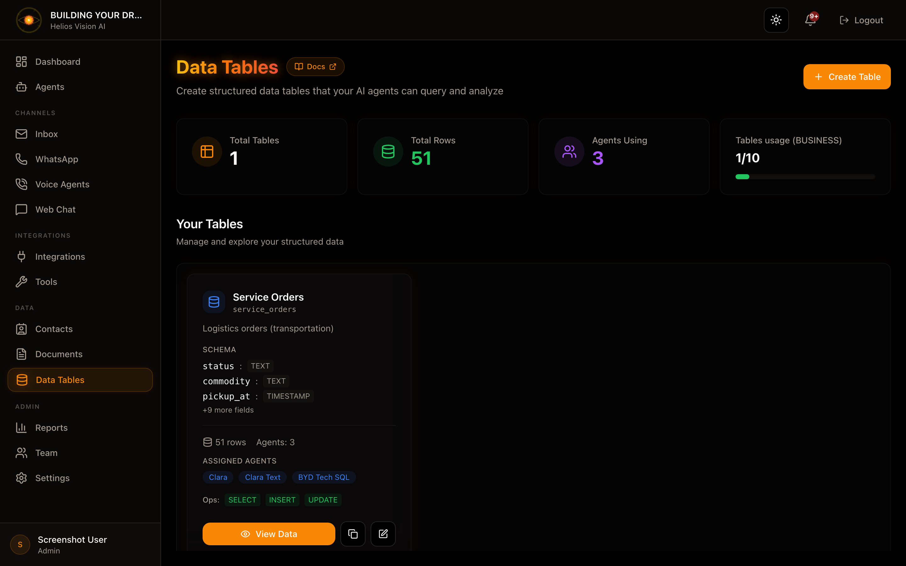

## Objetivo

Crear tablas de datos estructurados que tus agentes de IA pueden consultar usando lenguaje natural. Perfecto para bases de datos de clientes, seguimiento de inventario, gestión de pedidos y más.

## Acceso

Menú lateral -> Tablas de datos
Ruta: `/app/{tenant}/sql-tables`

## Roles con acceso

- owner, admin, agent

## Límites por plan

| Plan | Tablas | Filas máximas |
|------|--------|---------------|
| Free | 1 | 100 |
| Starter | 3 | 5,000 |
| Growth | 5 | 20,000 |
| Business | 10 | 50,000 |
| Enterprise | Ilimitadas | Ilimitadas |

---

## Crear una tabla

1. Pulsa **Crear tabla**
2. Completa el formulario
3. Pulsa **Crear tabla**

### Campos del formulario

| Campo | Obligatorio | Formato | Ejemplo | Nota |
|-------|-------------|---------|---------|------|
| Nombre de tabla (interno) | Sí | minúsculas + _ | pedidos_clientes | Identificador interno |
| Nombre visible | Sí | texto | Pedidos de clientes | Visible en la interfaz |
| Descripción | No | texto | Pedidos de clientes | Ayuda a los agentes |
| Esquema | Sí | lista de campos | pedido_id: TEXT | Define la estructura |
| Operaciones permitidas | Sí | selección múltiple | SELECT, INSERT | Limita operaciones |

### Tipos de campo disponibles

| Tipo | Descripción | Ejemplo |
|------|-------------|---------|
| TEXT | Texto libre | "Juan García", "ABC123" |
| NUMBER | Números enteros o decimales | 100, 99.99 |
| BOOLEAN | Verdadero/Falso | true, false |
| DATE | Solo fecha | 2024-01-15 |
| TIMESTAMP | Fecha y hora | 2024-01-15T14:30:00 |

---

## Ver y gestionar datos

Ruta: `/app/{tenant}/sql-tables/{id}`

### Funciones disponibles

- **Agregar fila**: Agregar un nuevo registro
- **Editar fila**: Editar un registro existente
- **Eliminar fila**: Eliminar un registro
- **Consulta en lenguaje natural**: Consultar con IA
- **Paginación**: Navegar entre páginas de datos

### Agregar una fila

El formulario genera un campo por cada columna del esquema.

Notas por tipo:
- **NUMBER**: Acepta números decimales (ej: 99.99)
- **BOOLEAN**: Selector Sí/No
- **DATE**: Selector de fecha
- **TIMESTAMP**: Selector de fecha y hora

---

## Consultas en lenguaje natural

Esta es la característica más poderosa de Tablas de datos. Escribe una pregunta en español o inglés y el agente la traduce a una consulta.

### Consultas que funcionan muy bien

| Tipo | Ejemplo de pregunta |
|------|---------------------|
| **Contar registros** | "¿Cuántos clientes tengo?" |
| | "¿Cuántos pedidos hay?" |
| **Suma (SUM)** | "¿Cuál es el total de ventas?" |
| | "¿Cuál es el ingreso total?" |
| **Promedio (AVG)** | "¿Cuál es el valor promedio de los pedidos?" |
| | "¿Cuál es el valor promedio por pedido?" |
| **Máximo (MAX)** | "¿Cuál es la venta más alta?" |
| | "¿Cuál es el monto de venta más alto?" |
| **Mínimo (MIN)** | "¿Cuál es el pedido más pequeño?" |
| | "¿Cuál es el pedido mínimo?" |
| **Filtrar por valor** | "Muestra pedidos mayores a $100" |
| | "Busca clientes de México" |
| **Filtrar por fecha** | "Pedidos de enero 2024" |
| | "Pedidos después del 1 de enero de 2024" |
| **Ordenar resultados** | "Muestra los últimos 10 pedidos ordenados por fecha" |
| | "Muestra pedidos ordenados por monto de mayor a menor" |
| **Combinaciones** | "¿Cuál es el total de ventas de pedidos mayores a $50?" |
| | "Precio promedio de productos agregados este mes" |

### Ejemplos prácticos por caso de uso

#### Para una tabla de Pedidos
```
"¿Cuántos pedidos hay en total?"
"¿Cuál es el monto total de ventas?"
"Muestra los pedidos mayores a $500"
"Pedidos del último mes ordenados por fecha"
"¿Cuál es el pedido más grande?"
```

#### Para una tabla de Clientes
```
"¿Cuántos clientes tenemos?"
"Clientes de México"
"Clientes registrados después del 1 de enero"
"Muestra los últimos 5 clientes agregados"
```

#### Para una tabla de Productos
```
"¿Cuántos productos hay?"
"¿Cuál es el precio promedio?"
"Productos con precio mayor a $100"
"Producto más caro"
"Producto más barato"
```

### Funcionalidades no soportadas (aún)

| Operación | Estado | Nota |
|-----------|--------|------|
| GROUP BY | En desarrollo | "Ventas por región" no funciona aún |
| JOIN | No soportado | No se pueden relacionar tablas |
| Condiciones OR | No soportado | Solo AND para combinar filtros |
| Subconsultas | No soportado | Consultas simples solamente |

### Notas técnicas

- **COUNT** funciona con cualquier cantidad de registros (precisión 100%)
- **SUM, AVG, MAX, MIN** se calculan sobre un máximo de 500 registros
- Los resultados se limitan a 100 filas por consulta
- Las fechas deben estar en formato ISO (YYYY-MM-DD)

---

## Asignar tablas a agentes

Para que un agente pueda consultar una tabla:

1. Ve a **Agentes** -> selecciona el agente
2. En la sección **Herramientas**, activa **Tablas de datos**
3. Selecciona las tablas que el agente puede consultar
4. Guarda los cambios

El agente ahora podrá responder preguntas sobre esas tablas en conversaciones de chat, email o voz.

---

## Buenas prácticas

1. **Nombres descriptivos**: Usa nombres claros para tablas y campos
2. **Campos en inglés**: Mantén los nombres de campos en inglés para mejor compatibilidad
3. **Limitar operaciones**: Solo habilita INSERT/UPDATE/DELETE si es necesario
4. **Descripciones útiles**: Agrega descripciones que ayuden al agente a entender los datos
5. **Tipos correctos**: Usa NUMBER para valores numéricos, DATE para fechas

---

## Solución de problemas

### "No se encontraron resultados"
- Verifica que hay datos en la tabla
- Revisa la ortografía de los valores buscados
- Intenta una consulta más simple primero

### "Error en la consulta"
- Evita usar OR en tus preguntas
- No pidas agrupar por categoría (GROUP BY)
- Asegúrate de que los campos existen en el esquema

### El agente no responde sobre la tabla
- Verifica que la tabla está asignada al agente
- Confirma que el agente tiene la herramienta "Tablas de datos" habilitada
- Revisa que "Operaciones permitidas" incluya SELECT

---


## Captura



## Relacionados

- [03-agents.md](./03-agents.md) - Configuración de agentes
- [09-tools.md](./09-tools.md) - Herramientas disponibles

---
