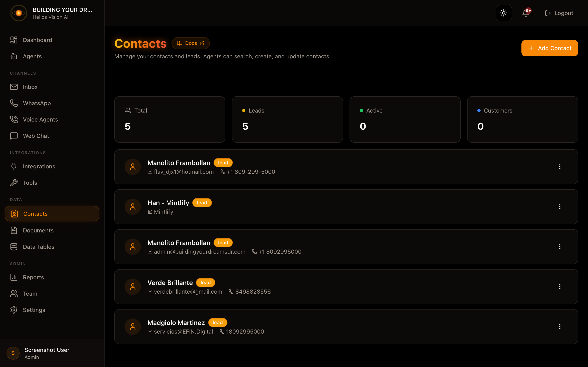

## Objetivo

Gestionar contactos y leads para que los agents puedan consultarlos y actualizarlos.

## Acceso

Sidebar -> Contacts
Ruta: /app/{tenant}/contacts

## Roles

- owner, admin, agent

## Crear contacto (Add Contact)

Paso a paso:

1. Pulsa Add Contact.
2. Completa el formulario.
3. Pulsa Create Contact.

Campos:

| Campo | Obligatorio | Formato | Ejemplo | Nota |
| --- | --- | --- | --- | --- |
| Name | Si | texto | John Doe | - |
| Status | No | lead/active/customer | lead | Estado del contacto |
| Email | No | email valido | john@acme.com | - |
| Phone | No | texto | +1 555 123 4567 | - |
| Company | No | texto | Acme Inc. | - |
| Job Title | No | texto | Sales Manager | - |
| Notes | No | texto | Cliente VIP | - |

## Editar contacto

1. En la lista, abre el menu (tres puntos).
2. Pulsa Edit.
3. Ajusta campos y pulsa Save Changes.

## Archivar contacto

1. En la lista, abre el menu.
2. Pulsa Archive.
3. Confirma.

## Buscar contactos

- Usa el buscador por nombre, email, telefono o company.

## Buenas practicas

- Mantener status actualizado (lead, active, customer).
- Completar Phone y Email para contacto rapido.
## Captura

