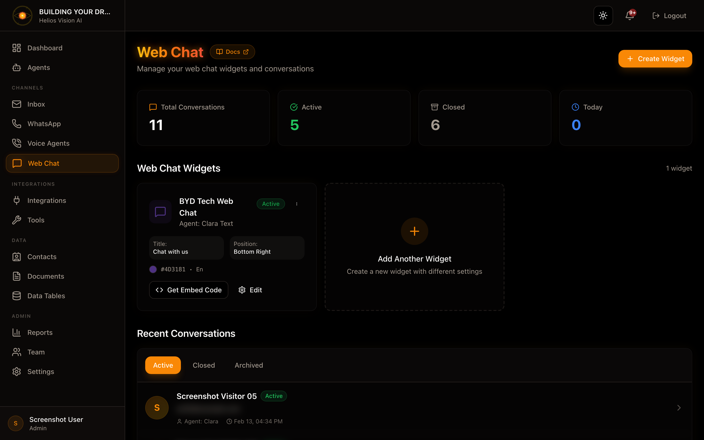

## Objetivo

Instalar el widget de chat en tu sitio web para iniciar conversaciones con agents.

## Requisitos

- Un agent con canal Web Chat habilitado.
- Acceso al HTML de tu sitio.

## Paso a paso (embed)

1. Obtiene tu tenantId y agentId.
2. Inserta el snippet antes de `</body>` en tu sitio:

```html
<script>
  (function() {
    window.HeliosChat = {
      tenantId: 'YOUR_TENANT_ID',
      agentId: 'YOUR_AGENT_ID',
      apiUrl: 'https://app.heliosvisionai.com'
    };
    var script = document.createElement('script');
    script.src = 'https://app.heliosvisionai.com/widget/helios-chat.js';
    script.async = true;
    document.body.appendChild(script);
  })();
</script>
```

3. Guarda cambios y recarga el sitio.

## Notas

- El agent debe tener Web Chat habilitado en Agents.
- Si cambias el agentId, las conversaciones nuevas usaran el nuevo agent.
## Captura



